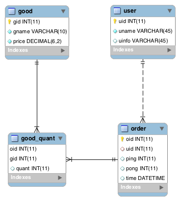

# TypeORM 使用笔记

目前的个人定位是前端开发，写后端代码的机会比较少，因而数据库相关的知识也有点生疏。这次写一个后台的数据统计系统，刚好借此机会复习下数据库及 ORM 的一般使用。这里使用的环境是 Node.js (v10.5.0) 环境，使用 MySQL 数据库，ORM 使用 [TypeORM](https://github.com/typeorm/typeorm) 。

## 建库建表

TypeORM 实际上是支持自动建表的，定义好 Model 后 TypeORM 实际上是可以自动为我们建表的。但考虑到更多的时候，我们建表都是从 EER 模型开始设计，这里就使用 MySQL Workbench 设计表解构。

这里我们模拟一个 `用户-订单` 的业务场景。用户 (`user`) 表和订单 (`order`) 表为一对多关系，订单 (`order`) 表和商品 (`good`) 表为多对多的关系，通过中间表 (`good_quant`) 进行关联，同时该中间表也负责记录每笔订单下每件商品购买数量的情况。大致关系如下：

