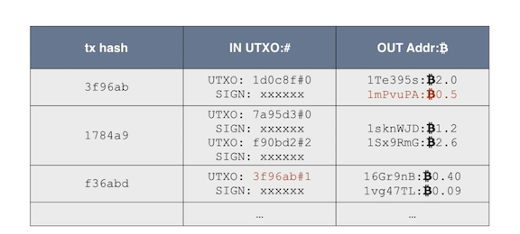

# 数字货币与区块链原理

原视频: [数字货币与区块链原理](https://www.feiyangedu.com/course/1bhmuur980ag081003l8)

## 数字货币

数字货币是**基于数学加密原理**构建的**不可伪造**的货币系统。
区别于电子货币(法币)。

比特币特点:

* 无需信任中心的发行机制
* 数量由程序决定，无法随意修改
* 交易账本公开可追溯，不可篡改
* 密码学理论保证货币防伪造、放双花
* 数字签名机制保证交易可信，不可抵赖和撤销

用户通过钱包软件将交易发送至 P2P 网络，由旷工打包。
用户交易记录在全网总账本中，且每一页新记录都指向上一页记录，称为**区块链**，账本在每个节点进行复制。

## 区块链

* 区块链就是一个不断增长的全网总账本
* 每个节点都拥有完整的区块链
* 节点总是信任最长的区块链
* 伪造区块链需要拥有超过51%的全网算力

一个区块包含: 区块 Hash -- 上衣区块 Hash -- Merkle Hash -- 交易记录

1. 哈希算法

单向函数，将任意长度输入转化为固定长度输出。
低碰撞率(输入无限，输出有限)。
输出无规律。

常用哈希算法: MD5(128 bit = 16 bytes) / RipeMD160(160) / SHA-1(160) / SHA-256(256) / SHA-512(512)

比特币使用 hash256 (两次SHA-256) 和 hash160 (先SHA-256再RipeMD160)

2. 区块结构

Merkle Hash: dhash(dhash(tx1) + dhash(tx2)) 若无 tx2 则复制 tx1

Block Hash: 通过计算头部信息得到 hash256(Version, Prev Hash, ...)

Prev Hash: 指向上一区块

修改任意交易导致 Merkle Hash 验证不通过，重新计算导致 Block Hash 改变，使得下一区块的 Prev Hash 链接断裂。

## P2P 交易

验证声明由申明者发出且申明者拥有相应余额，即为可信交易。

### 数字签名

签名是为了验证某个申明是由某人发出。

SK (Secret Key / Private Key) / PK (Public Key)

私钥签名 `signature = sign(message, SK)` ，公钥验证 `verify(message, signature, PK)` 。

常用签名算法: RSA / DSA / ECDSA(比特币使用)。

### 公钥和私钥

* 私钥是 1 - 2^256 位随机数
* 公钥由 ECDSA 算法推算出 (两个 256 位整数)
* 通过公钥无法反推私钥

### 钱包

用来管理私钥 (本地/在线/纸/脑)。

非压缩格式的私钥地址: 256 位整数 -- 32 bytes integer (a) -- 0x80 + 32 bytes (b) -- sha256(sha256(b)) (c) -- b + c(0, 4) (d) -- 
base58(d) -- 5开头字符串编码(私钥导入地址)

压缩格式私钥地址: b = 0x80 + a + 0x01 -- L/K开头字符串编码

非压缩格式公钥地址: 0x40 + 32 bytes (a1) + 32 bytes (a2) (b) -- ripemd160(sha256(b)) (c) -- 0x00 + c (d) -- 
sha256(sha256(d)) (e) -- d + e(0, 4) (f) -- base58(f) -- 1开头字符串编码

压缩格式私钥: b = 0x02/0x03 + a1

### 交易

一个输入可以对应多个输出，输入可能略大于输出，差额为交易费用。

如上，在交易 f36abd 中，输入为 3f96ab 中第 #1 个输出。

## 挖矿

## 支付

